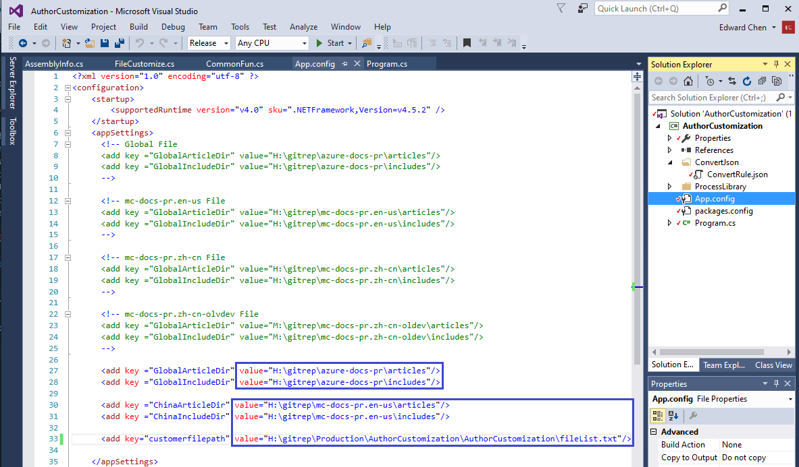
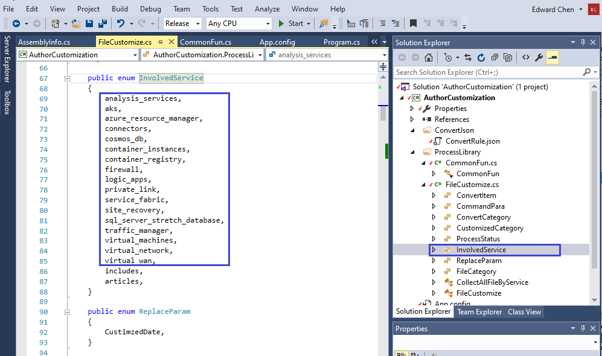
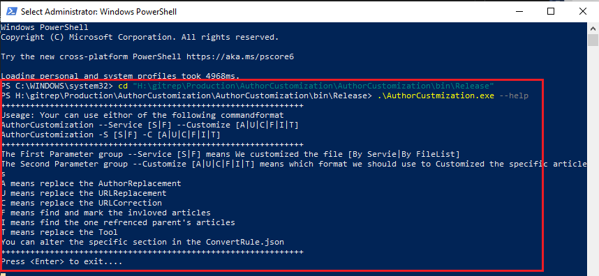

# Application Introduction

There are two category application, ***main application*** and ***tool application***, to help us customize the Azure Global documents during our daily work. It will promote our effect and reduce the unessary mistakes.

## Application List

We have selected four applications and demostrate the function and result.
* Main Application
    * AuthorCustomization
* Tools
    * CheckBrokenLink
    * Redirect
    * H1ToTitle

### Main Application

The AuthorCustomization is main application to customize the global document. 

In the first day of each sync cycle, We will collect the customized articles list by using the `git diff` in shell scripts, and make a job schedule in next month.


|Category|Function | Useage |
|--------|---------|--------|
|Main | <ol><li>update the meta properties such as ms.date, ms.author, </li><li>Replace the Endpoint and Refrence Link </li><li>Correct the wrong Endpoint and Refrence Link in second step. </li> </ol>| <ol><li>Update the configuration in the file of App.config.</li><li>./AuthorCustomization --help</li></ol> |

### Tool Application

We have list the selected 3 tool application.

1. CheckBrokenLink

    |Category|Function | Useage |
    |--------|---------|--------|
    |Tool |<ol><li>Check the images in the corresponding repo in local PC. </li><li>Check the reference link such as https://docs.azure.cn, and external URL. </li><li>Generate the text file in local PC, which help user to correct the broken link in later.</li> </ol> |  <ol><li>Update the configuration in the file of App.config.</li><li>./CheckBrokenLink.exe --help</li><li>./CheckBrokenLink.exe --Service S --Customize R <br/>It is the function to scan the articles based on the service and generate the broken result in local file.</li></ol> |

    The following image show the process in the 

2. Redirect

    |Category|Function | Useage |
    |--------|---------|--------|
    |Tool |<ol><li>Check the images in the corresponding repo in local PC. </li><li>Check the reference link such as https://docs.azure.cn, and external URL. </li><li>Generate the text file in local PC, which help user to correct the broken link in later.</li> </ol> |  <ol><li>Update the configuration in the file of App.config.</li><li>./CheckBrokenLink.exe --help</li><li>./CheckBrokenLink.exe --Service S --Customize R <br/>It is the function to scan the articles based on the service and generate the broken result in local file.</li></ol> |

3. H1ToTitle

    |Category|Function | Useage |
    |--------|---------|--------|
    |Tool| H1ToTitle | <ol>Update the title property in meta data collection with article's H1 content. /ol>| refer to the --help usage. |


### CheckBrokenLink

### Redirect

### H1ToTitle

|Category|Application Name|Function | Useage |
|------|-------|-------|---|
|Main| AuthorCustomization | <ol><li>update the meta properties such as ms.date, ms.author, </li><li>Replace the Endpoint and Refrence Link </li><li>Correct the wrong Endpoint and Refrence Link in second step. </li> </ol>| <ol><li>Update the configuration in the file of App.config.</li><li>./AuthorCustomization --help</li></ol> |
|Tool| CheckBrokenLink |<ol><li>Check the images in the corresponding repo in local PC. </li><li>Check the reference link such as https://docs.azure.cn, and external URL. </li><li>Generate the text file in local PC, which help user to correct the broken link in later.</li> </ol> |  <ol><li>Update the configuration in the file of App.config.</li><li>./CheckBrokenLink.exe --help</li><li>./CheckBrokenLink.exe --Service S --Customize R <br/>It is the function to scan the articles based on the service and generate the broken result in local file.</li></ol> |
|Tool| Redirect | <ol><li>Scan the removed file and generate the both Json and Excel result. </li><li>The Json content will be added to .openpublishing.redirection.json after verified. </li></ol>|  refer to the --help usage. |
|Tool| H1ToTitle | <ol>Update the title property in meta data collection with article's H1 content. /ol>| refer to the --help usage. |

## Application Usage

We will demo the unified process based on AuthorCustomization, and you can also update the others application with similiar step.

1. Open the project sln file with Visual Studio Application.

2. Select the app.Config file in the right Solution Explorer panel. Update the configuration with your actual file name and path.

    

    > [!NOTE]
    > We will add the customized files list in the text file that was recorded in the  `customerfilepath` key of App.config file.
    >
    > Each item is similiar to the following format: 
    > `aks-migration.md	articles/aks	05/25/2020`
    > The three parts are file name, path, and customized date which were splited with Tab key in the keyboard.
    >
    > We can use Excel application to generate the files list and copy the content to text file directly.

    > [!TIP]
    > For customized tool such as CheckBrokenLink, We did not generate the text file when using parameter group `--Service S`.
    >

3. Select the AuthorCustomization > ProcessLibrary > InvlovedService file in the right Solution Explorer panel. Replace the service item with your actual service name.

    > [!NOTE]
    > * The dash(-) in service name will be replace underline(_) before adding service name in enum.
    > * The last two item, includes and articles, are mandatory in this InvolvedService enum.
    >

    

4. Save all the modified files in the project, and rebuild the project. 

5. Open the Powershell console with administrator priviledge. Change the path to the /bin/release directory in this project. Run the following scripts to get the usage of application.

    ```PowerShell
    ./.\AuthorCustmization.exe --help
    ```

    

    > [!NOTE]
    > All the Regular Express collections are saved in the ConvertRule.json file. We can find this file with following path of `AuthorCustomization` > `ConvertJson`.
    >
    > We should maintance the ConvertRule.json file if there are any new Regular Express replacement required.
    >
    > 


